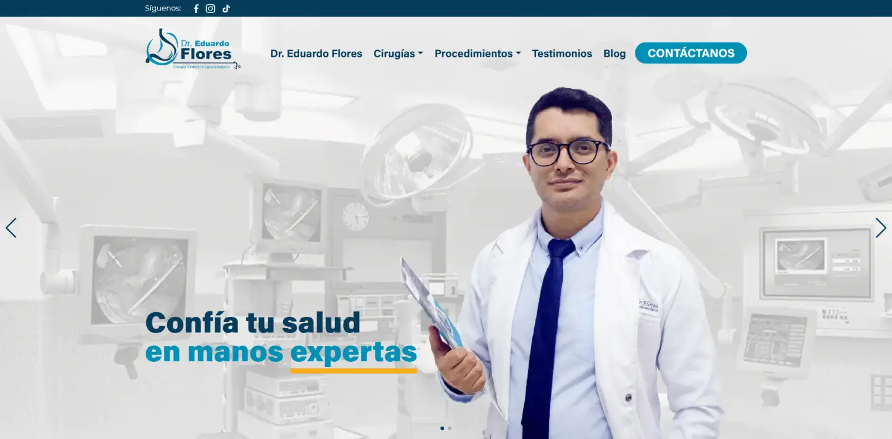

# Tema WordPress: Dr. Manuel Eduardo Flores Vilchez



## Descripción

Este tema de WordPress ha sido desarrollado para la web profesional del **Dr. Manuel Eduardo Flores Vilchez**, especialista en Cirugía General y Laparoscópica. El sitio está orientado a brindar información sobre servicios médicos, procedimientos quirúrgicos, testimonios de pacientes y recursos de contacto.

## Estructura del tema

- Plantillas personalizadas para la página principal, blog, testimonios y contacto.
- Integración con campos personalizados (PODS) para mayor flexibilidad.
- Carrusel de testimonios y slider de héroe en la portada.
- Sección de preguntas frecuentes y blog de procedimientos.
- Estilos modernos y responsivos utilizando Bootstrap y SASS.

## Instalación

1. Copia la carpeta del tema en el directorio `/wp-content/themes/` de tu instalación de WordPress.
2. Activa el tema desde el panel de administración de WordPress.
3. Asegúrate de tener instalados los plugins necesarios para campos personalizados (por ejemplo, PODS).

## Compilación de SASS

Para modificar o personalizar los estilos, este tema utiliza SASS.  
Para compilar los archivos SCSS a CSS, ejecuta el siguiente comando en la raíz del tema:

```bash
sass --watch assets/scss:assets/css --style compressed
```

Esto observará los cambios en los archivos `.scss` y generará automáticamente los archivos `.css` comprimidos en la carpeta correspondiente.

## Personalización

Puedes personalizar los colores, tipografías y estilos modificando los archivos en `assets/scss/`. Recuerda recompilar SASS después de realizar cambios.

## Vista previa del tema

Puedes encontrar una vista previa del tema en la imagen `screenshot.webp` incluida en la raíz del tema. Esta imagen muestra cómo se ve la página principal utilizando este tema.

Además, puedes visitar la web en producción para ver el tema en funcionamiento:

[https://dreduardoflorescirugia.pe/](https://dreduardoflorescirugia.pe/)